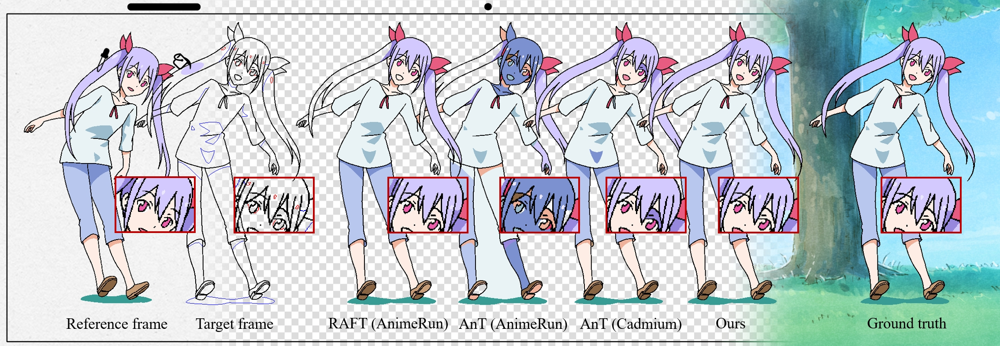

# Learning Inclusion Matching for Animation Paint Bucket Colorization

[Project Page](https://ykdai.github.io/projects/InclusionMatching) | [Video](https://www.youtube.com/watch?v=nNnPUItGvSo)



This repository provides the official implementation for the following paper:

<p>
<div><strong>Learning Inclusion Matching for Animation Paint Bucket Colorization</strong></div>
<div><a href="https://ykdai.github.io/">Yuekun Dai</a>, 
     <a href="https://shangchenzhou.com/">Shangchen Zhou</a>,
     <a href="https://github.com/dienachtderwelt">Qinyue Li</a>, 
     <a href="https://li-chongyi.github.io/">Chongyi Li</a>,
     <a href="https://www.mmlab-ntu.com/person/ccloy/">Chen Change Loy</a></div>
<div>Accepted to <strong>CVPR 2024</strong></div><div><a href=https://arxiv.org/abs/2403.18342> arXiv </a>
</p>

### BasicPBC
Colorizing line art is a pivotal task in the production of hand-drawn cel animation. 
In this work, we introduce a new learning-based inclusion matching pipeline, which directs the network to comprehend the inclusion relationships between segments. To facilitate the training of our network, we also propose a unique dataset **PaintBucket-Character**. This dataset includes rendered line arts alongside their colorized counterparts, featuring various 3D characters.

### Update
- **2024.04.08**: Model inference updated. Support all resolutions and unclosed line art images.
- **2024.03.30**: The checkpoint and training code of our BasicPBC are released.
- **2024.03.29**: This repo is created.

### TODO
- [X] Add trapped-ball segmentation module for unclosed line arts inference.
- [ ] Add a lightweight BasicPBC which can process images in 2K resolution without encountering Out-Of-Memory (OOM) error on 8GB RAM GPU.

### Installation

1. Clone the repo

    ```bash
    git clone https://github.com/ykdai/BasicPBC.git
    ```

1. Install dependent packages

    ```bash
    cd BasicPBC
    pip install -r requirements.txt
    ```

1. Install BasicPBC
    Please run the following commands in the **BasicPBC root path** to install BasicPBC:

    ```bash
    python setup.py develop
    ```

### Data Download

The details of our dataset can be found at [this page](https://github.com/ykdai/BasicPBC/tree/main/dataset). Dataset can be downloaded using the following links. 

|     | Google Drive | Baidu Netdisk | Number | Description|
| :--- | :--: | :----: | :---- | ---- |
| PaintBucket-Character Train/Test | [link](https://drive.google.com/file/d/1gIJVKyeIu4PQshZnHG6TWj5kSZjnMb2_/view?usp=sharing) | [link](https://pan.baidu.com/s/12AMfqwlPF-7R30RWRdUBfg?pwd=cvpr) | 11,345/3,000 | 3D rendered frames for training and testing. Our dataset is a mere 2GB in size, so feel free to download it and enjoy exploring. 😆😆 |
| PaintBucket-Real Test            |                              /                               |                              /                               | 200          | Hand-drawn frames for testing.                               |

Due to copyright issues, we do not provide download links for the real hand-drawn dataset. Please contact us through the e-mail if you want to use it. These hand-drawn frames are only for evaluation and not for any commercial activities. 

### Pretrained Model

You can download the pretrained checkpoints from the following links. Please place it under the `ckpt` folder and unzip it, then you can run the `basicsr/test.py` for inference. 

|  Google Drive   |  Baidu Netdisk  |
| :-------------: | :-------------: |
| [link](https://drive.google.com/file/d/1QOUaulX9-mZo5wyKpWw_9QUKkRwBwMU2/view?usp=sharing)  | [link](https://pan.baidu.com/s/1CCbtoQmzYs8Q2rvSHL9-5w?pwd=cvpr) |

We also have plans to release a lightweight model, please stay tuned!🤗

### Model Inference
To estimate the colorized frames with our checkpoint trained on PaintBucket-Character, you can run the `basicsr/test.py` by using:
```bash
python basicsr/test.py -opt options/test/basicpbc_pbch_test_option.yml
```
The colorized results will be saved at `results/`.

To inference on your own data, put your animation clip(s) under `dataset/test/`. The clip folder should contain the colorized `gt` of the 1st frame and `line` of all frames. We provide a simple example `laughing_girl`.
```
├── dataset 
    ├── test
        ├── laughing_girl
            ├── gt
                ├── 0000.png
            ├── line
                ├── 0000.png
                ├── 0001.png
                ├── ...
```
Run the `inference_line_frames.py` by using:
```bash
python inference_line_frames.py --path dataset/test/laughing_girl
```
Find results under `results/`.

If your anime clip contains unclosed line art images, try running with our new argument `--seg_type trappedball`. To use this feature, first clone the LineFiller repository (acknowledge <a href="https://github.com/hepesu">@HEPESU</a>):
```bash
# under BasicPBC root directory:
git clone https://github.com/hepesu/LineFiller.git
```

### Model Training

**Training with single GPU**

To train a model with your own data/model, you can edit the `options/train/basicpbc_pbch_train_option.yml` and run the following codes. 

```bash
python basicsr/train.py -opt options/train/basicpbc_pbch_train_option.yml
```

**Training with multiple GPU**

You can run the following command for multiple GPU training:

```bash
CUDA_VISIBLE_DEVICES=0,1 bash scripts/dist_train.sh 2 options/train/basicpbc_pbch_train_option.yml
```

### BasicPBC structure

```
├── BasicPBC
    ├── assets
    ├── basicsr
        ├── archs
        ├── data
        ├── losses
        ├── metrics
        ├── models
        ├── ops
        ├── utils
    ├── dataset
    	├── train
	    	├── PaintBucket_Char
        ├── test
        	├── PaintBucket_Char
        	├── PaintBucket_Real
    ├── experiments
    ├── options
        ├── test
        ├── train
    ├── paint
    ├── raft
    ├── results
    ├── scripts
```

### License

This project is licensed under <a rel="license" href="https://github.com/ykdai/BasicPBC/blob/main/LICENSE">S-Lab License 1.0</a>. Redistribution and use of the dataset and code for non-commercial purposes should follow this license.

### Citation

If you find this work useful, please cite:

```
@article{InclusionMatching2024,
  title     = {Learning Inclusion Matching for Animation Paint Bucket Colorization},
  author    = {Dai, Yuekun and Zhou, Shangchen and Li, Qinyue and Li, Chongyi and Loy, Chen Change},
  journal   = {CVPR},
  year      = {2024},
}
```

### Contact
If you have any question, please feel free to reach me out at `ydai005@e.ntu.edu.sg`.
