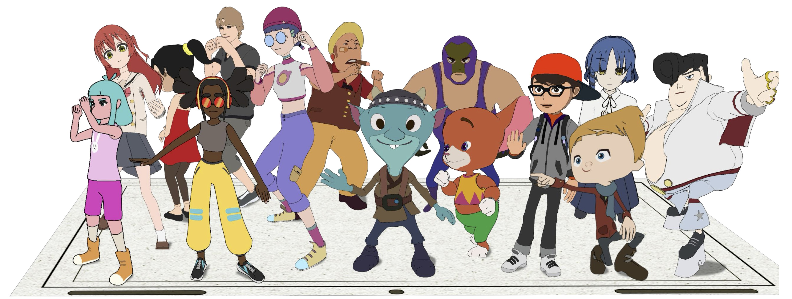
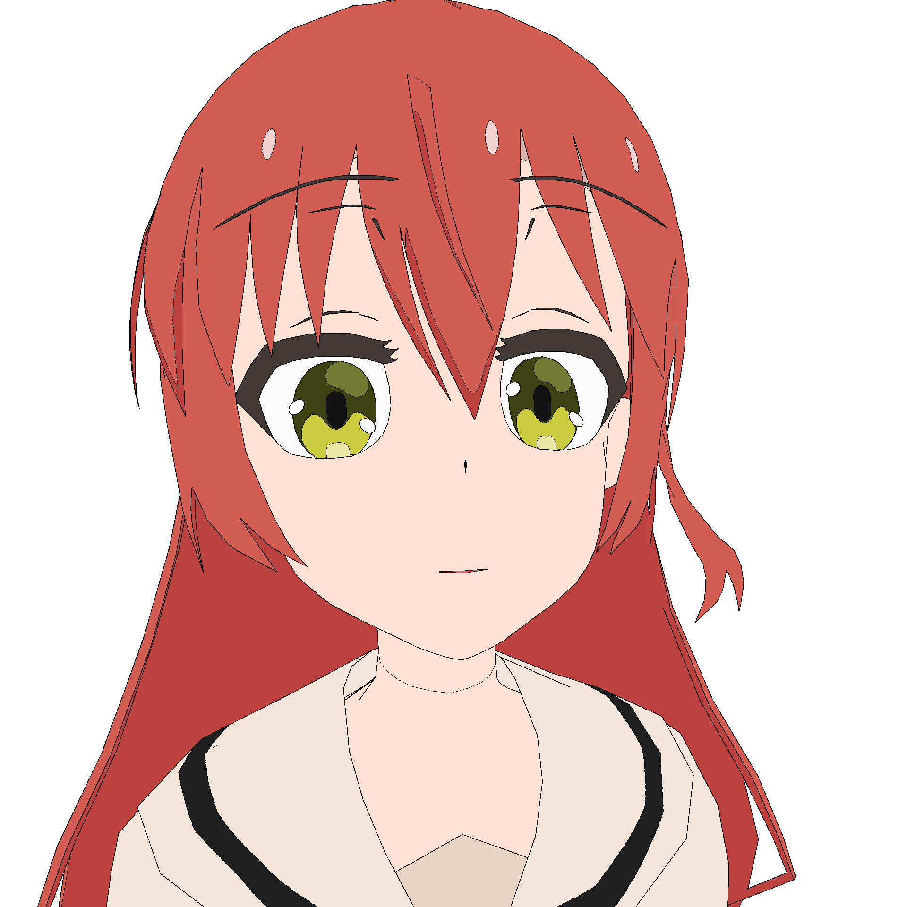
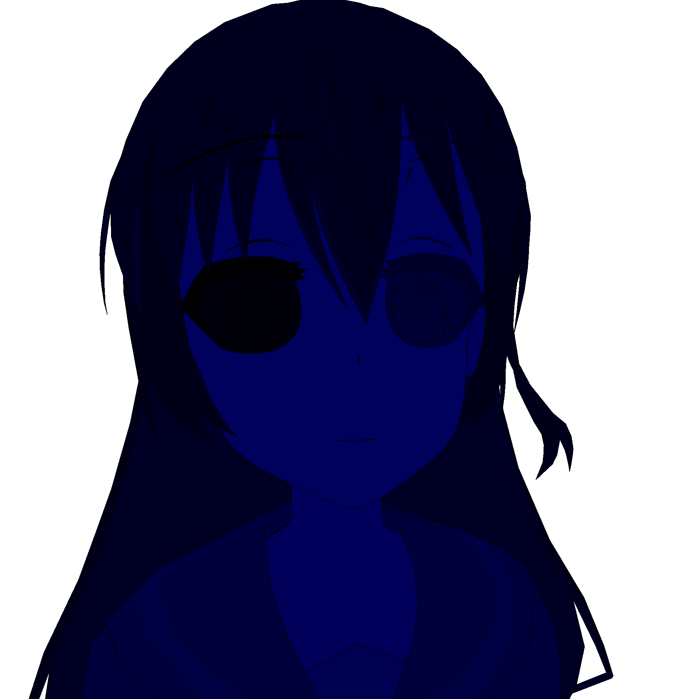
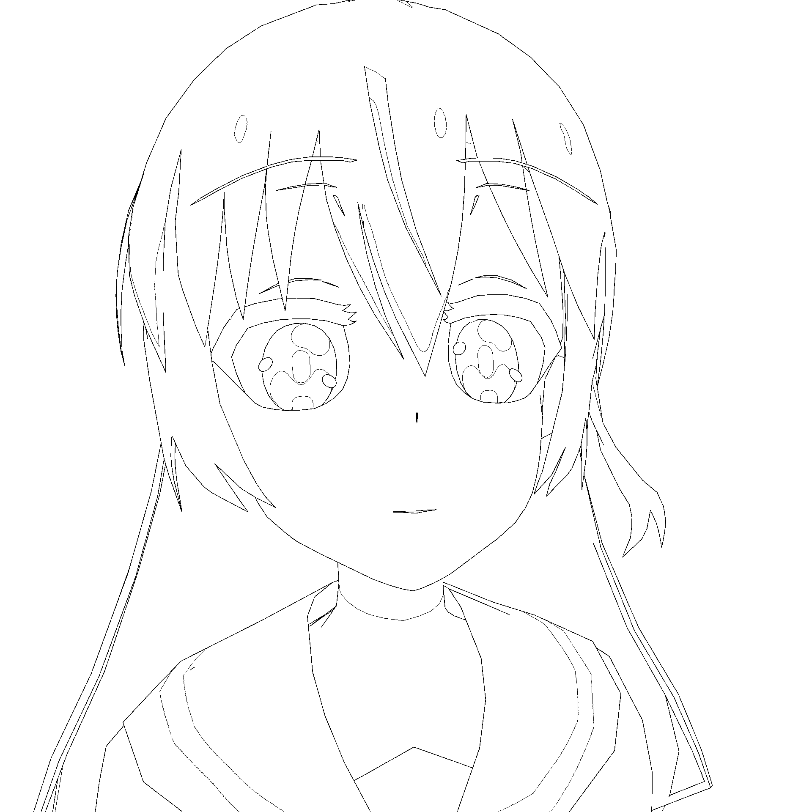
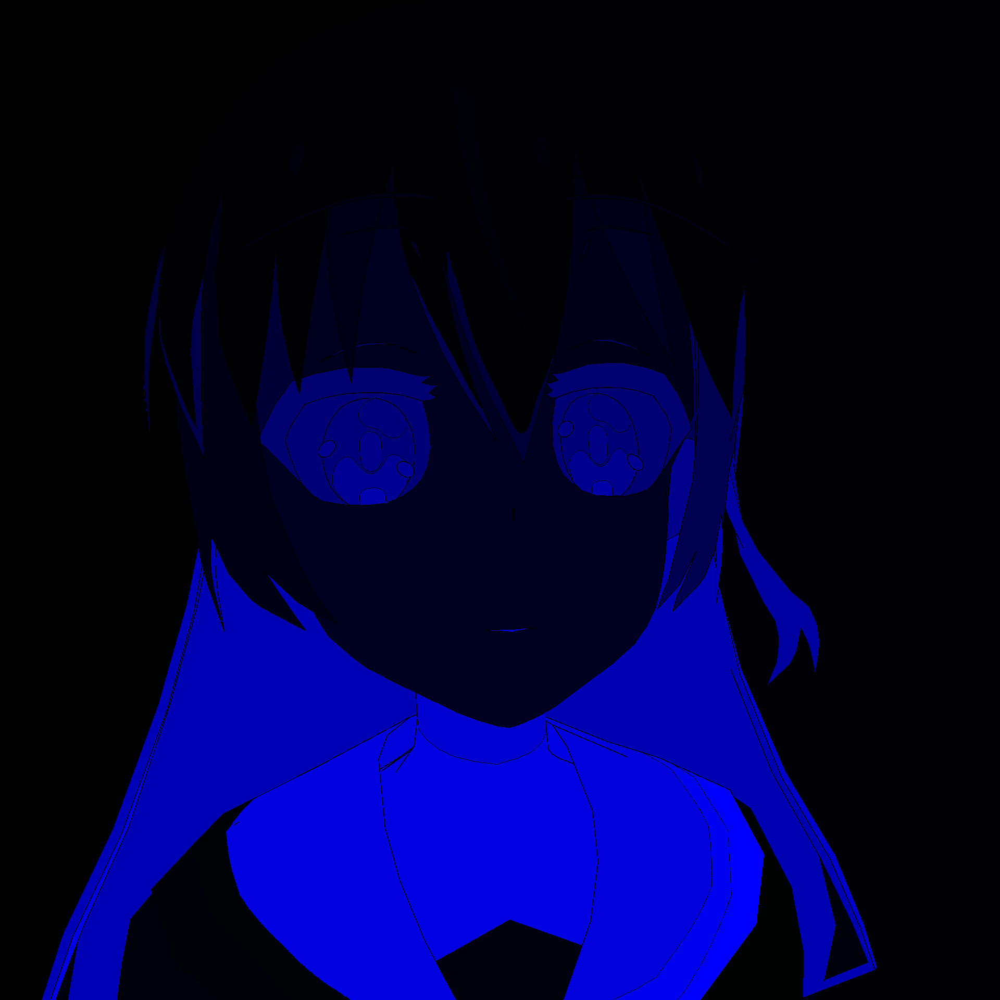

# PaintBucket-Character Dataset v2


Compared with previous dataset, this version contains more features:

1. For both the training and test, we provide `line_anno`  which represent the line art with shading annotations. To simplify the annotations, we pre-process the line arts and ignore the color lines around the shading annotations.  Each color represents the meaning:

   ```
   Hightlight:
   	Hair:   [239, 238, 52]
   	Skin:   [255, 227, 185] 
   	Others: [255, 245, 139]
   Shadow: 
   	Hair:   [185, 137, 253] 
   	Skin:   [255, 179, 196] 
   	Others: [188, 201, 251]
   
   ```

2. `ref` contains the color design sheet for the T-pose character from different viewpoints.

3. `colorbook.yml` is the text-color list. A typical text-color setting is like `eyelash on eye: [[39 64 59],[19 44 39],[38 13 18],null]` which means `{Text Description} on {Semantic category}: [highlight color, normal color, shadow color1, shadow color2]`. In this dataset, headwear and beard are also classified as hair. To make it simple, we do not use the shadow color2 in our paper although 2 shadow colors are quite common in [animation industry](https://setteidreams.net/color-designs/):

   

4. `shadow` indicate the shadow and highlight regions. It is the intermediate data. Each color represents:

   ```
   Highlight: [250, 250, 250]
   Normal:    [200, 200, 200] 
   Shadow:    [100, 100, 100]
   ```

   

5. **Note**: For certain characters, clipping and non-standard mesh topology can lead to incorrect semantic labels and shadows. To prevent these issues, we do not provide the *line_anno* and *shadow* labels for **Kaya** and **Kita** in the training set, and in the testing set, we exclude them for **Bocchi** and **Ichika**. These 4 characters are not used to train or evaluate the keyframe colorization model. (We just use 10 characters for training and 8 for evaluation for key frame colorization). As these characers can still be useful for training the consecutive frame colorization model, we have kept the remaining parts of these characters in the folder.
We introduce an innovative dataset named **PaintBucket-Character**. This dataset includes rendered line
arts alongside their colorized counterparts, featuring various 3D characters including both Japanese and Western cartoon styles.

# PaintBucket-Character Dataset v1

### Data Download

Dataset can be downloaded using the following links. 

|                                  |                         Google Drive                         |                        Baidu Netdisk                         | Number       | Description                                                  |
| :------------------------------- | :----------------------------------------------------------: | :----------------------------------------------------------: | :----------- | ------------------------------------------------------------ |
| PaintBucket-Character Train/Test | [link](https://drive.google.com/file/d/1gIJVKyeIu4PQshZnHG6TWj5kSZjnMb2_/view?usp=sharing) | [link](https://pan.baidu.com/s/12AMfqwlPF-7R30RWRdUBfg?pwd=cvpr) | 11,345/3,000 | 3D rendered frames for training and testing. Our dataset is only in 2GB, feel feel to download it and have fun~ |
| PaintBucket-Real Test            |                              /                               |                              /                               | 200          | Hand-drawn frames for testing.                               |

Due to copyright issues, we do not provide download links for the real hand-drawn dataset. Please contact us through the e-mail if you want to use it. These hand-drawn frames are only for evaluation and not for any commercial activities. 

After downloading the dataset, please put the it in `BasicPBC/dataset`. If your folder structure is different, you may need to change the corresponding paths in config files.

```
BasicPBC
├── dataset
    ├── train
        ├── PaintBucket_Char
    ├── test
        ├── PaintBucket_Char
        ├── PaintBucket_Real
```

### PaintBucket-Character Train

The training dataset comprises 11,345 3D rendered frames of 12 characters in separate folders.

```
dataset
├── train
│   ├── PaintBucket_Char
│   │   ├── Abe
│   │   │   ├── gt
│   │   │   ├── json_color
│   │   │   ├── json_index
│   │   │   ├── label
│   │   │   ├── line
│   │   │   ├── seg
│   │   ├── Aj
│   │   ├── BigVegas
│   │   ├── Clarie
│   │   ├── Doozy
│   │   ├── Jackie
│   │   ├── Kaya
│   │   ├── Kita
│   │   ├── Ortiz
│   │   ├── Remy
│   │   ├── Ryo
│   │   ├── TheBoss
```

- **gt**: Colorized Ground truth of the frames. The image is a 4-channel RGBA image with transparent background, please use `paint.utils.read_img_2_np` to load it.



- **label**: Index label for different regions of the character. Each region shares the same index in all frames. Index can be calculated using `index=R*256^2+G*256+B`. For the transparent region, index is set as -1. Please use `paint.utils.read_seg_2_np` to read it as a 2D numpy array.



- **line**: Line-art frames. They are binarized 4-channel images with black lines and transparent background. Please use `paint.utils.read_img_2_np` to load it.



- **seg**: Each segment (line-enclosed region) 's serial number. (e.g. segment No.42's color is [0,0,42].) Please use `paint.utils.read_seg_2_np` to read it as a 2D numpy array.



- **json_color**: Each segment (line-enclosed region)'s RGBA value. Please use `paint.utils.load_json` to load it. 

```json
{
    "1": [0, 0, 0, 0],
    "2": [243, 229, 218, 255],
    "3": [210, 93, 83, 255],
    ... ...
}
```

- **json_index**: Each segment (line-enclosed region)'s number of pixels and it corresponding label's index.
   e.g. "2": [16, 27] means that segment No.2's corresponding label is index 27 and it has 16 pixels. (segment 1 is always the background with index -1.) 

```json
{
    "1": [2829395, -1],
    "2": [152325, 61],
    "3": [428, 25],
    ... ...
}
```


### PaintBucket-Character Test

This dataset contains 3,000 3D rendered frames of 10 characters for testing. Folder structure is almost the same as training set except that:

- **seg**: combines contents of **seg** and **json_color** in training set. **png** files give each segment an index. **json** file contains ground truth color for each segment.

```
dataset
├── train
├── test
│   ├── PaintBucket_Char
│   │   ├── amy
│   │   │   ├── gt
│   │   │   ├── line
│   │   │   ├── seg
│   │   │   |   ├── 0000.json
│   │   │   |   ├── 0000.png
│   │   │   |   ├── ... ...
│   │   ├── Bocchi
│   │   ├── Ichika
│   │   ├── michelle
│   │   ├── mousey
│   │   ├── Mremireh_O_Desbiens
│   │   ├── Racer
│   │   ├── Sporty_Granny
│   │   ├── timmy
│   │   ├── Ty
```

### PaintBucket-Real

This dataset has 200 hand-drawn frames from 20 short clips.

```
dataset
├── train
├── test
│   ├── PaintBucket_Real
│   │   ├── dog
│   │   │   ├── gt
│   │   │   ├── line
│   │   │   ├── seg
│   │   ├── hairflycoolboy
│   │   ├── hairflyinggirl
│   │   ├── idol
│   │   ├── jumpinggirl
│   │   ├── kyogirl
│   │   ├── laughinggirl
│   │   ├── closeeye
│   │   ├── robothand
│   │   ├── runninggirl
│   │   ├── selfprotectboy
│   │   ├── shockinggirl
│   │   ├── sittinggirl
│   │   ├── smilinggirl
│   │   ├── standupboy
│   │   ├── strongman
│   │   ├── turningaroundboy
│   │   ├── turningaroundgirl
│   │   ├── typing
│   │   ├── witcher
```
