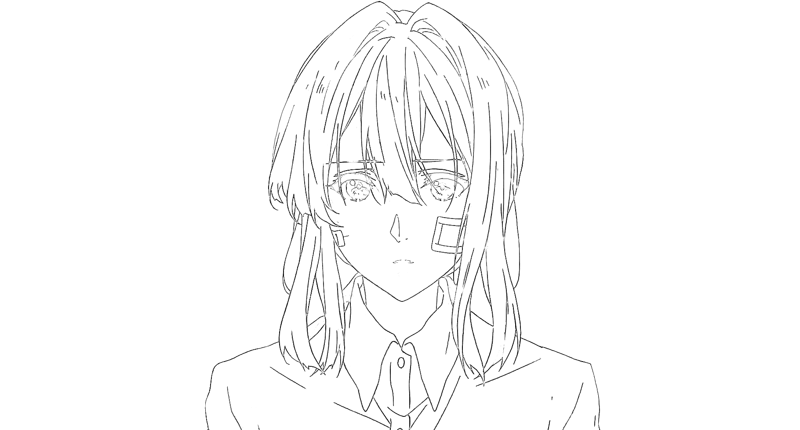
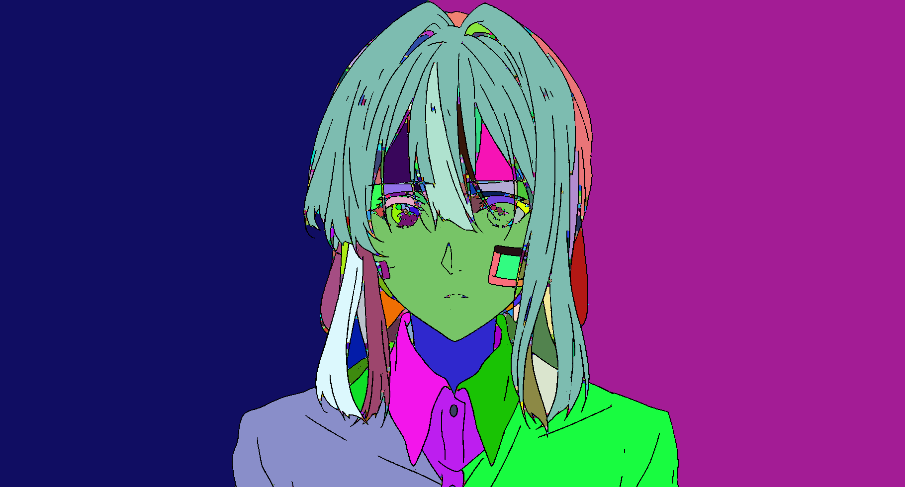
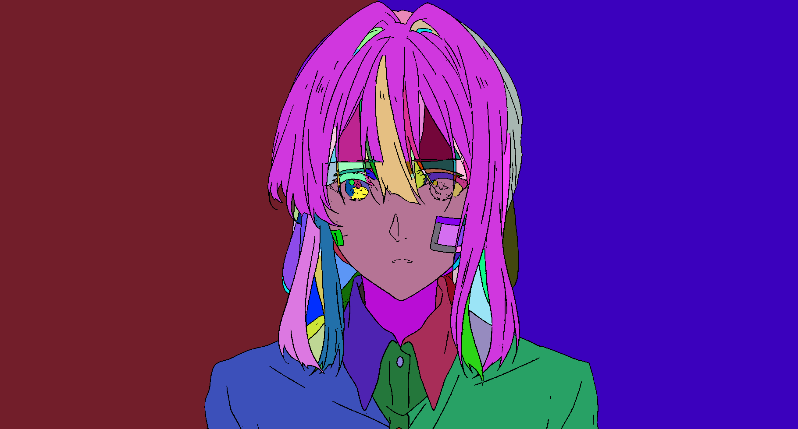
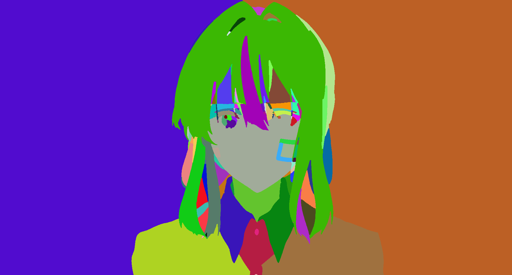

# LineFiller
Leak-proofing line art filling and segmentation based on trapped-ball filling.

The Full pipeline including different deep learning models and algorithm. For now, the repository only including trapped-ball filling(segmentation).

1. Input is be prepocessed by deep learning model LineCloser and LineThinner, these result a nice normalization line-drawing. **Work in progess**
2. A combination of Trapped-ball and FloodFill algorithm are used to do segmentation, the raw output will be processed by simple merge operation. **Done**
3. For each segment, a deep learning model LineFeature is used to extract features, then a cluster algorithm is used for grouping. **Work in progess**
4. Using LineFeature for classification or comparing to determine the color palatte by exmpale or user input. **Work in progess**

Extra pipelien

1. Using model from JACS for color palatte design. **Work in progess**
2. Using LineShader for shading. **Work in progess**
3. Using a model for coloring stylization. **Work in progess**

## Example
The line art is drawn with reference from Violet Evergarden.

Result using trapped-ball and floodfill pipeline. Only floodfill leads result with leak.

Result after merged.

Result after performed line thinning.

From **Project HAT** by Hepesu With :heart:
